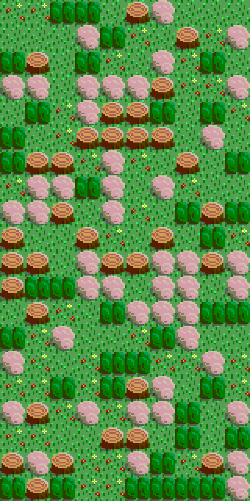

# tile-map
A simple program that creates an 'x' by 'y' big rectangle containing the integers 0 through 4 and writes it into a file. Another program then takes the data and creates a tile map using Pygame. 

## Objectives
- Learn how to read and write within files
- Learn how to blit images using Pygame

## How to use

Above is sample tiles, with a desert theme on the left and forest theme on the right. 

An example of a tile map data file would look like:

('4', '4')
| 0 | 1 | 3 | 0 |
|---|---|---|---|
| 2 | 1 | 4 | 1 |
| 4 | 3 | 2 | 2 |
| 0 | 3 | 1 | 2 |

where the top 2 numbers represent the dimensions, and the table represents randomly assorted integers. Then you run tile_map_generator.py, where it will output a .png file:

In this case the example is a 10 x 20 rectangle, using the forest theme
